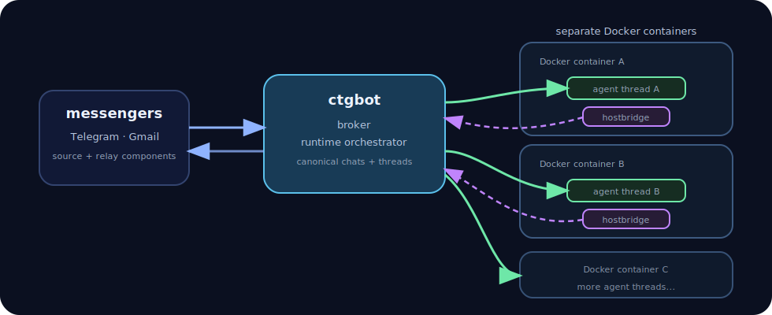

# `ctgbot`

`ctgbot` is an agentic engineering platform with an agent-first architecture and security by design.

It routes conversations into isolated sandboxes where agents can freely install and run software.

Runtime containers can be refreshed back to a clean state without losing conversation history.

<p align="center">
  
</p>

ctgbot is under active development. The architecture is usable today, but command names and component setup may still change.

## Core model

- Chats receive messages from external channels.
- Threads isolate agent conversations.
- Each thread receives its own runtime sandbox.
- Components provide agents, commands, sources, and integrations.
- Host access is exposed through explicit bridges instead of direct machine access.

## What agents get

A real engineering environment.

Each sandboxed thread runs in its own container. Agents can install packages,
run tests, build tools, inspect repositories, create artifacts, run services,
exchange files, communicate with other threads, read message history, and use
restricted `hostbridge` commands.

Each thread has isolated runtime state. Experiments stay contained and do not
dirty the host or other conversations.

## What humans get

Operators control which channels are trusted, which components are attached,
which workspaces are mounted, and which command surfaces are exposed.

Unknown channels are dropped until explicitly bound.

ctgbot is designed around explicit trust boundaries instead of ambient authority.

## Design focus

ctgbot focuses on the environment an agent receives after the message arrives:
isolated runtime state, durable workspaces, explicit components, controlled host
access, and reproducible execution environments.

## Quick start: Telegram + Codex

This quick start sets up Telegram + Codex. Additional components are optional.

### Requirements

- Go 1.24+
- Git
- Docker or Docker Desktop
- A Telegram bot token
- Codex auth

### 1. Install ctgbot

```bash
git clone https://github.com/bartdeboer/ctgbot.git
cd ctgbot

go run ./cmd/ctgbot install
ctgbot version
```

### 2. Create an instance folder

ctgbot stores instance state in the current directory under `.ctgbot/`.

```bash
mkdir -p ~/run/ctgbot-01
cd ~/run/ctgbot-01
```

### 3. Configure basics

A workspace is the host project directory mounted into agent containers.

```bash
ctgbot workspace set default --path /absolute/path/to/workspace

ctgbot config set git.user_name "Your Name"
ctgbot config set git.user_email "you@example.com"
```

### 4. Register Telegram

```bash
ctgbot component register telegram/telegram --runtime local

mkdir -p .ctgbot/components/telegram/telegram
printf '%s' "$TELEGRAM_BOT_TOKEN" > .ctgbot/components/telegram/telegram/token.txt

cat > .ctgbot/components/telegram/telegram/component.json <<'JSON'
{
  "operators": [123456789]
}
JSON
```

### 5. Register Codex and operator commands

```bash
ctgbot component register codex/codex --runtime docker
ctgbot component register process/process --runtime local
```

### 6. Build runtime images

Docker-based agent components need their runtime image before auth or turns can
start containers.

```bash
ctgbot image list
ctgbot image build --no-cache
```

### 7. Authenticate Codex

```bash
ctgbot component codex/codex auth
ctgbot component codex/codex auth status
```

### 8. Run ctgbot

```bash
ctgbot run
```

Use a process supervisor for production deployments.

### 9. Bind your Telegram chat

Send a message to the Telegram bot from the chat you want to use. Unknown
channels are recorded as dropped until you bind them.

```bash
ctgbot chat dropped
ctgbot chat bind telegram/telegram <telegram_id> "My Chat"
ctgbot chat list

ctgbot chat <chat> workspace set default
ctgbot chat <chat> component add agent codex/codex
ctgbot chat <chat> component add command process/process
ctgbot chat <chat> component list
```

Use Telegram topics to create separate agent conversations, each with its own
thread and sandbox.

## Hostbridge

`hostbridge` is the controlled bridge from an agent container back to ctgbot and
the host. Agents use it to send files, message other threads, read message
history, inspect available components, and run explicit host command aliases.

### Workspace command aliases

Hostbridge aliases are configured per workspace. Add only commands you are
comfortable letting agents run.

Example `.ctgbot/config.json`:

```json
{
  "workspaces": {
    "default": {
      "path": "/absolute/path/to/workspace",
      "hostbridge": {
        "allowed_commands": {
          "git-fetch": {
            "name": "git",
            "args": ["fetch", "--all", "--prune"],
            "dir": "/absolute/path/to/workspace"
          },
          "git-push": {
            "name": "git",
            "args": ["push"],
            "dir": "/absolute/path/to/workspace",
            "delay": "500ms"
          }
        }
      }
    }
  }
}
```

Agents can then run:

```bash
hostbridge git-fetch
hostbridge git-push
```

## Optional components

### Claude

Minimal Claude chat setup:

```bash
ctgbot component register claude/claude --runtime docker
ctgbot component register process/process --runtime local
ctgbot image build --no-cache
ctgbot component claude/claude auth
ctgbot component claude/claude auth status

ctgbot chat bind telegram/telegram <telegram_id> "Claude #1"
ctgbot chat <chat> workspace set default
ctgbot chat <chat> component add agent claude/claude
ctgbot chat <chat> component add command process/process
ctgbot chat <chat> component list
```

Claude auth runs `claude setup-token` in the component runtime. If it returns a
`CLAUDE_CODE_OAUTH_TOKEN`, store it in the component profile:

```bash
mkdir -p .ctgbot/components/claude/claude
cat > .ctgbot/components/claude/claude/runtime.json <<'JSON'
{
  "env": [
    "CLAUDE_CODE_OAUTH_TOKEN=sk-ant-oat..."
  ]
}
JSON
```

### Gmail

```bash
ctgbot component register gmail/personal --runtime local

mkdir -p .ctgbot/components/gmail/personal
cat > .ctgbot/components/gmail/personal/component.json <<'JSON'
{
  "mailbox_email": "you@example.com"
}
JSON

cp oauth_client.json .ctgbot/components/gmail/personal/oauth_client.json

ctgbot component gmail/personal auth
ctgbot component gmail/personal auth status
ctgbot chat <chat> component add source gmail/personal --external-channel-id you@example.com

# From an agent runtime, send directly through Gmail:
hostbridge gmail/personal message "Monthly report" \
  --to you@example.com \
  --subject "Monthly report" \
  --attach "/workspace/out/report.pdf;type=application/pdf"
```

### Inbound filters

Filters are attached to specific chat/source bindings.

```bash
# Sender allowlist.
ctgbot component register filters/allowlist --runtime local
ctgbot chat <chat> component gmail/personal filter add filters/allowlist

# LLM guard using a completion provider.
ctgbot component register llamacpp/qwen3-q5 --runtime backend
ctgbot component register guard/qwen --runtime local

mkdir -p .ctgbot/components/guard/qwen
cat > .ctgbot/components/guard/qwen/component.json <<'JSON'
{
  "completion": "llamacpp/qwen3-q5"
}
JSON

ctgbot chat <chat> component gmail/personal filter add guard/qwen
```

Allowlist commands:

```text
/allowlist dropped view <drop_id>
/allowlist whitelist sender@example.com
/allowlist whitelist list
/allowlist whitelist remove sender@example.com
```

## Useful chat commands

```text
/status
/version
/quit
/upgrade
/codex status
/codex container refresh
/claude status
/claude container refresh
/thread list
/thread component bind gmail/personal
```

## Useful hostbridge commands

Inside an agent runtime:

```bash
hostbridge help
hostbridge component list
hostbridge component <component> help
hostbridge thread list
hostbridge message "hello"
hostbridge message "Report attached" --attach /workspace/out/report.pdf
hostbridge sendstdin
hostbridge sendfile <path>
```

## Why agents want ctgbot

> I can be more useful when I have my own safe place to work.

## License

Apache-2.0.
